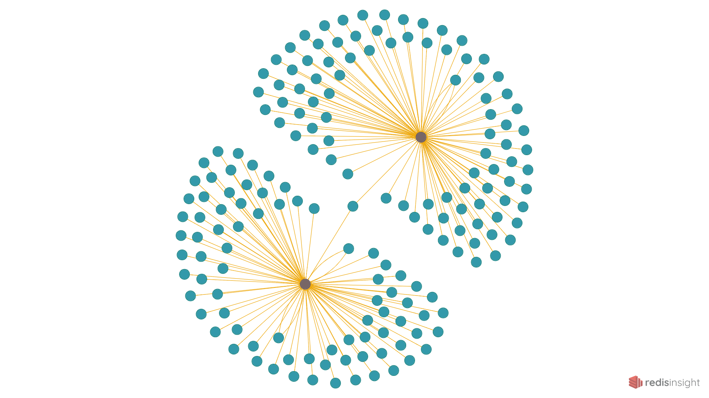

# RedisGraph Demo

This is a RedisGraph Demo dataset containing CSV Data and a python script for migrating data into RedisGraph Database.

Following are the pre-requisites for using RedisGraph.

## Installing Redis
Reference and more detailed steps: [here](https://redis.io/download#installation)

```bash
$ wget http://download.redis.io/redis-stable.tar.gz

$ tar xvzf redis-stable.tar.gz

$ cd redis-stable

$ make

$ make test

$ sudo make install
```

## Build RedisGraph Module
Reference and more detailed steps: [here](https://oss.redislabs.com/redisgraph/)

```bash
# Ubuntu/Linux

$ sudo apt-get install build-essential cmake m4 automake peg libtool autoconf

# Mac

$ brew install cmake m4 automake peg libtool autoconf

$ git clone --recurse-submodules -j8 [https://github.com/RedisGraph/RedisGraph.git](https://github.com/RedisGraph/RedisGraph.git)

$ cd RedisGraph

$ make
```

#### Once build succeeds, load the module into the redis-cli
```bash
$ module load /path/to/module/src/redisgraph.so
```

## Data Set
JSON data has been converted to CSV from a public API provided at [An API of Ice and Fire](https://anapioficeandfire.com/).

Data collected from 3 endpoints have been divided in such a way that can be used to build graph nodes and relations as follows:
### Nodes:
* Book
* Writer
* Character
* House
### Relationships/Edges:
* Wrote : writer - wrote - book
* Belongs : character - belongs (to) - house

## Usage
### Options:
```bash
$ python3 bulk_insert.py --help
Usage: bulk_insert.py [OPTIONS] GRAPH

Options:
  -h, --host TEXT                Redis server host
  -p, --port INTEGER             Redis server port
  -a, --password TEXT            Redis server password
  -n, --nodes TEXT               Path to node csv file  [required]
  -r, --relations TEXT           Path to relation csv file
  -c, --max-token-count INTEGER  max number of processed CSVs to send per
                                 query (default 1024)
  -b, --max-buffer-size INTEGER  max buffer size in megabytes (default 2048)
  -t, --max-token-size INTEGER   max size of each token in megabytes (default
                                 500, max 512)
  --help                         Show this message and exit.
```

### Dependencies:
```bash
$ pip3 install click redis
```

### Migration Command:
```bash
$ python3 bulk_insert.py GOT_DEMO -n data/character.csv -n data/house.csv -n data/book.csv -n data/writer.csv -r data/wrote.csv -r data/belongs.csv
```

### Sample RedisGraph Query Commands:

##### Note:

Reference images taken using Redis Insight, more details and installation steps can be found [here](https://redislabs.com/redisinsight/).

Listing all the writers and books.

```bash
127.0.0.1:6379> match (w:writer)-[wrote]->(b:book) return w,b
```


Finding all the characters that belong to either `House Stark of Winterfell` or `House Lannister of Casterly Rock`.


```bash
127.0.0.1:6379> match (c:character)-[belongs]->(h:house) WHERE (h.name = 'House Stark of Winterfell' OR h.name = 'House Lannister of Casterly Rock') return c,h
```


## Contributing

1.  Fork it!
2.  Create your feature branch (`git checkout -b my-new-feature`)
3.  Commit your changes (`git commit -am 'Add some feature'`)
4.  Push to the branch (`git push origin my-new-feature`)
5.  Create a new Pull Request
